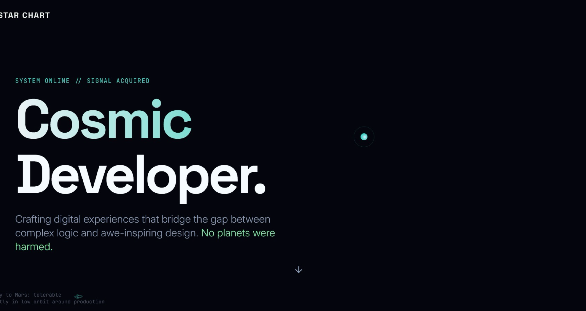
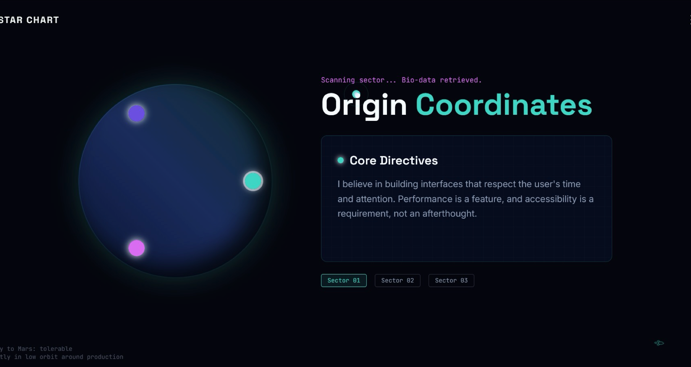
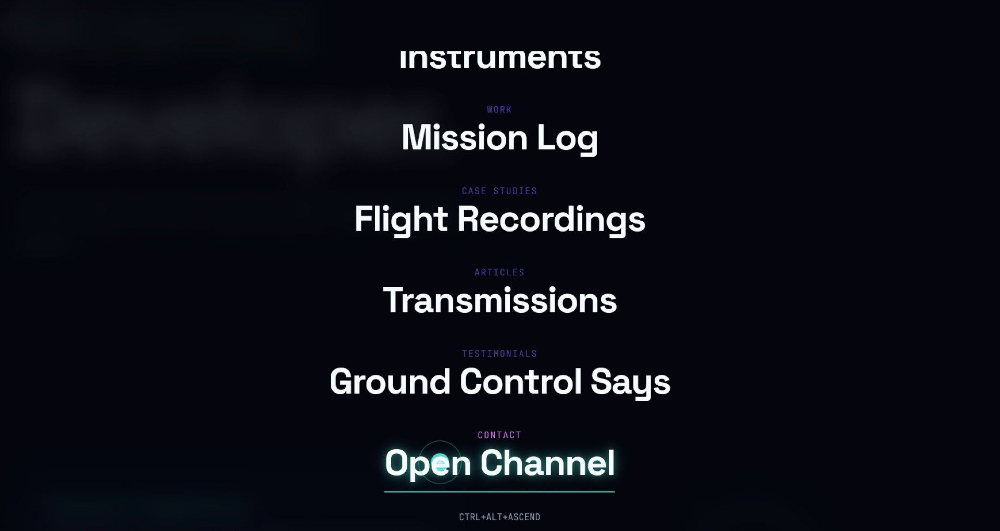
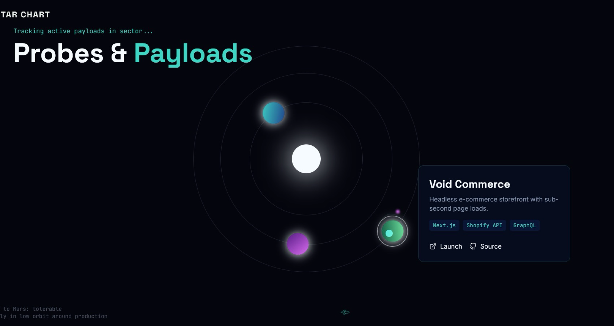
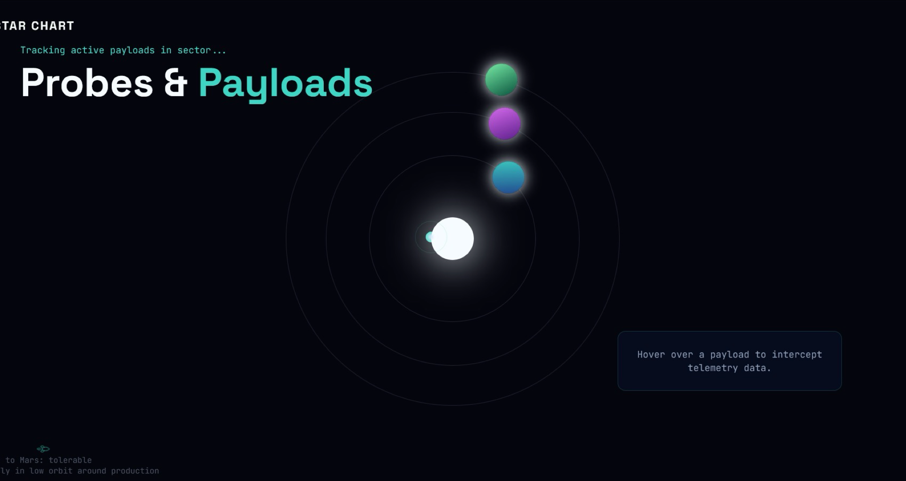
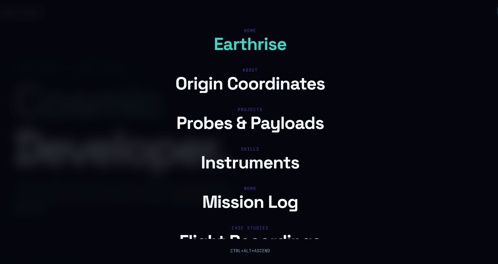

<!--
File: README.md
Document Title: Cosmic Developer — Static Portfolio Theme
Author: Alysha Pursley
Date: August 2026
-->

<div align="center">



<h1>Cosmic Developer — Static Portfolio Theme 🌌</h1>

<p><a href="https://github.com/apursley2012/cosmic-developer/stargazers"></a> <a href="https://github.com/apursley2012/cosmic-developer/forks"></a> <a href="https://github.com/apursley2012/cosmic-developer/issues"></a> <a href="https://github.com/apursley2012/cosmic-developer/commits"></a> <a href="https://github.com/apursley2012/cosmic-developer"></a> <a href="https://github.com/apursley2012/cosmic-developer"></a></p>

<p><a href="https://apursley2012.github.io/cosmic-developer/"></a>       </p>

<p><strong>A developer portfolio framed as a voyage through code, projects, and skills with a sleek cosmic interface. This responsive static theme is organized for direct GitHub Pages deployment and is designed to be customized as its own standalone site.</strong></p>

<p><a href="https://apursley2012.github.io/cosmic-developer/">Open the live demo</a> · <a href="https://apursley2012.github.io/theme-bulletin/">Browse the Theme Bulletin collection</a> · <a href="https://github.com/apursley2012/cosmic-developer/issues/new/choose">Report an issue or request an addition</a></p>

</div>

---

## Table of Contents 📖

*   [Project Overview 🔎](#project-overview)
    *   [Purpose 🎯](#purpose)
    *   [Design Style and Inspiration 🎨](#design-style-and-inspiration)
    *   [Main Color Palette 🌈](#main-color-palette)
    *   [Preview Screenshots 🖼️](#preview-screenshots)
*   [Key Features ✨](#key-features)
*   [Tech Stack 🛠️](#tech-stack)
*   [Live Demo 🚀](#live-demo)
*   [Installation 📦](#installation)
    *   [Local Development 💻](#local-development)
    *   [GitHub Pages Deployment 🌐](#github-pages-deployment)
*   [Usage 🧭](#usage)
*   [Project Structure 🗂️](#project-structure)
    *   [Pages Included 📄](#pages-included)
    *   [Component Architecture 🧩](#component-architecture)
    *   [Shared Theme Components 🧱](#shared-theme-components)
    *   [Shared Site Assets 🗃️](#shared-site-assets)
    *   [Theme-Specific Interactive Behavior ⚙️](#theme-specific-interactive-behavior)
    *   [File and Folder Structure 🌳](#file-and-folder-structure)
*   [Customization Guide 🎨](#customization-guide)
*   [Accessibility and Browser Compatibility ♿](#accessibility-browser)
*   [Repository Relationship 🔗](#repository-relationship)
*   [Possible Future Enhancements 💡](#future-enhancements)
*   [Contributing 🤝](#contributing)
    *   [Reporting Theme Issues 🐛](#reporting-theme-issues)
    *   [Requesting Additions 📝](#requesting-additions)
*   [License 📜](#license)
*   [Important Links 🔗](#important-links)
*   [Attribution ℹ️](#attribution)

---

<a id="project-overview"></a>

<details open>
<summary><h2><strong>Project Overview 🔎</strong></h2></summary>


**Cosmic Developer** is a developer portfolio framed as a voyage through code, projects, and skills with a sleek cosmic interface. This responsive static theme is organized for direct GitHub Pages deployment and is designed to be customized as its own standalone site.

I treat the theme as a complete website system rather than a single styled homepage. Its structure supports about, articles, casestudies, contact, home and additional dedicated pages, so the visual concept carries through the parts of a professional site that visitors actually need to use. The layout, navigation, typography, palette, imagery, and interactive details are coordinated so the theme keeps a recognizable identity without making the content difficult to scan.

From an implementation standpoint, repeated behavior is separated into reusable pieces such as AuroraBackground.js, CustomCursor.js, Footer.js, Navigation.js. That organization keeps shared page behavior consistent and makes the design easier to customize without having to rebuild the same navigation, shell, or effect on every page. The result is a standalone theme that can be published independently, adapted to different professional content, and still preserve the design decisions that make **Cosmic Developer** distinct.

</details>

<a id="purpose"></a>

<details open>
<summary><h3><strong>Purpose 🎯</strong></h3></summary>


I created **Cosmic Developer** for developers and technical professionals who want a professional site that feels intentionally designed rather than interchangeable with a generic portfolio template. The theme uses a developer portfolio framed as a voyage through code, projects, and skills with a sleek cosmic interface to give the site a clear identity while still keeping projects, skills, experience, writing, and contact information practical to navigate. I also built it as a reusable standalone static site so the design can be customized and published independently without depending on Theme Bulletin or a larger application.
</details>

<a id="design-style-and-inspiration"></a>

<details open>
<summary><h3><strong>Design Style and Inspiration 🎨</strong></h3></summary>


I built the visual system for **Cosmic Developer** around mission-control, orbital, telemetry, and space-interface cues, then used the palette, typography, panels, and motion to reinforce that direction consistently. I kept the page hierarchy and navigation straightforward beneath the visual treatment so the site still behaves like a professional portfolio. Specialized effects remain separated into named components, which lets me refine the interface without rewriting unrelated content.

I carry that visual direction through the full interface rather than limiting it to the hero. The palette, page surfaces, navigation states, decorative elements, and interactive components are meant to reinforce the same theme on project, writing, experience, and contact content. I also keep the structure underneath those effects predictable so visitors can still recognize headings, links, controls, and page relationships immediately.

</details>

<a id="main-color-palette"></a>

<details open>
<summary><h3><strong>Main Color Palette 🌈</strong></h3></summary>


I use the following colors in the current theme stylesheet. The hex values come from the actual CSS, the color names are readable approximations, and the usage notes describe where each value appears in the interface.

Each row lists every interface-use category identified for that exact color value in the documented stylesheet analysis. When one hex value is reused for several jobs, I keep all of those uses together in the same row instead of reducing it to a single generic label.

| Hex | Approximate Color Name | Complete Use in the Interface |
| --- | --- | --- |
| `#3DD6C4` | Mediumturquoise | text, icons, labels, and other foreground details; gradient stops, decorative fills, and visual accent treatments |
| `#D96CF0` | Orchid | gradient stops, decorative fills, and visual accent treatments; text, icons, labels, and other foreground details |
| `#F5FBFF` | Ghostwhite | gradient stops, decorative fills, and visual accent treatments; box-shadow, text-shadow, halo, and glow treatments |
| `#04050D` | Black | page, section, card, panel, control, and other background fills; text, icons, labels, and other foreground details |
| `#7AF0A8` | Lightgreen | gradient stops, decorative fills, and visual accent treatments; box-shadow, text-shadow, halo, and glow treatments |
| `#6B4FE0` | Slateblue | text, icons, labels, and other foreground details; borders, outlines, dividers, and focus-edge treatments |
| `#8B9BB4` | Darkgray | gradient stops, decorative fills, and visual accent treatments; text, icons, labels, and other foreground details |
| `#1A2B5C` | Midnightblue | gradient stops, decorative fills, and visual accent treatments |
| `#0A1535` | Black | gradient stops, decorative fills, and visual accent treatments; page, section, card, panel, control, and other background fills |
| `#312E81` | Darkslateblue | gradient stops, decorative fills, and visual accent treatments |

</details>

<a id="preview-screenshots"></a>

<details open>
<summary><h3><strong>Preview Screenshots 🖼️</strong></h3></summary>


Click any preview image to open the full-size file.


#### 🖼️ Screenshot Gallery


I included the verified screenshots below from the supplied **cosmic-developer** capture set. I removed duplicate and obviously badly cropped captures before adding them here.

<div align="center">
  <a href="./screenshots/cosmic-developer-screenshot-1.png"></a>
  <a href="./screenshots/cosmic-developer-screenshot-2.png"></a>
</div>

[Open screenshot 1](./screenshots/cosmic-developer-screenshot-1.png) · [Open screenshot 2](./screenshots/cosmic-developer-screenshot-2.png)

<div align="center">
  <a href="./screenshots/cosmic-developer-screenshot-3.png"></a>
  <a href="./screenshots/cosmic-developer-screenshot-4.png"></a>
</div>

[Open screenshot 3](./screenshots/cosmic-developer-screenshot-3.png) · [Open screenshot 4](./screenshots/cosmic-developer-screenshot-4.png)

<div align="center">
  <a href="./screenshots/cosmic-developer-screenshot-5.png"></a>
  <a href="./screenshots/cosmic-developer-screenshot-6.png"></a>
</div>

[Open screenshot 5](./screenshots/cosmic-developer-screenshot-5.png) · [Open screenshot 6](./screenshots/cosmic-developer-screenshot-6.png)

</details>

---

<a id="key-features"></a>

<details open>
<summary><h2><strong>Key Features ✨</strong></h2></summary>


*   **Aurora Background**: Builds the decorative background layer that establishes this theme's visual atmosphere.
*   **Custom Cursor**: Handles the custom cursor effect while keeping normal links and buttons usable.
*   **Footer**: Provides the **Footer** interface element used by this theme, keeping its visual behavior separated from the page content.
*   **Navigation**: I use this for the theme’s navigation so visitors can move between sections without each page defining its own menu.
*   **Page Transition**: Adds lightweight page or content transitions so navigation feels connected without replacing the content.
*   **Starfield Background**: Builds the decorative background layer that establishes this theme's visual atmosphere.
*   **Multi-page portfolio structure**: Includes 10 HTML entry files so major portfolio sections can be opened directly and remain GitHub Pages-friendly.
*   **Code-defined visual system**: The CSS uses a theme-specific palette led by `#3DD6C4` and supporting colors documented below rather than relying on a generic default palette.
*   **Static-hosting friendly**: Uses repository-relative assets and a root-level `index.html` so the published site can run on GitHub Pages without a server-side runtime.

</details>

---

<a id="tech-stack"></a>

<details open>
<summary><h2><strong>Tech Stack 🛠️</strong></h2></summary>


*   **Markup**: I use HTML for the published page structure.
*   **Styling**: I use CSS for the theme palette, layout, responsive behavior, typography, and visual effects.
*   **Logic**: I use JavaScript for browser-side interaction and shared interface behavior.
*   **UI Runtime**: The delivered files include React-compatible compiled JavaScript where the preserved theme runtime requires it.
*   **Animation**: I use Framer Motion in themes where the preserved runtime includes those motion effects.
*   **Hosting Target**: I publish the theme with GitHub Pages or another static web host.
*   **Repository Format**: I keep the published repository browser-ready, with no server-side runtime required for the theme itself.

</details>

---

<a id="live-demo"></a>

<details open>
<summary><h2><strong>Live Demo 🚀</strong></h2></summary>


[Cosmic Developer live demo](https://apursley2012.github.io/cosmic-developer/)

I publish **Cosmic Developer** as its own site. Theme Bulletin is where I group and browse the collection, but this repository holds the files for this design and can stand on its own.

</details>

---

<a id="installation"></a>

<details open>
<summary><h2><strong>Installation 📦</strong></h2></summary>


</details>

<a id="local-development"></a>

<details open>
<summary><h3><strong>Local Development 💻</strong></h3></summary>


I keep the published version static so it can be previewed and deployed without rebuilding the original source application.

1. Clone the repository:

```bash
git clone https://github.com/apursley2012/cosmic-developer.git
cd cosmic-developer
```

2. Start a simple local web server from the repository root. For example:

```bash
python -m http.server 8000
```

3. Open `http://localhost:8000` in a browser.

I recommend using a local server instead of opening the HTML files with `file://`, because module scripts and browser security rules can behave differently from a hosted site.

</details>

<a id="github-pages-deployment"></a>

<details open>
<summary><h3><strong>GitHub Pages Deployment 🌐</strong></h3></summary>


1. Fork or copy this repository into your GitHub account.
2. Keep `index.html` at the repository root.
3. Keep `.nojekyll` at the repository root when it is included.
4. Commit the complete asset, component, image, and page folders.
5. Open **Settings → Pages**.
6. Under **Build and deployment**, choose **Deploy from a branch**.
7. Select `main` and `/(root)`.
8. Save the setting and open the published Pages URL after deployment finishes.
9. Test every page, navigation link, screenshot path, and interactive effect on desktop and mobile.

</details>

---

<a id="usage"></a>

<details open>
<summary><h2><strong>Usage 🧭</strong></h2></summary>


I use **Cosmic Developer** as a complete multi-page site, not just a decorated homepage. The main content can be replaced without changing the design system, and the navigation, page structure, and shared styling stay consistent from one section to the next.

The more theme-specific behavior lives in files such as `components/AuroraBackground.js`, `components/CustomCursor.js`, `components/Footer.js`, `components/Navigation.js`, `components/PageTransition.js`. I kept those pieces separate so normal content edits do not require digging through the visual-effect code.

</details>

---

<a id="project-structure"></a>

<details open>
<summary><h2><strong>Project Structure 🗂️</strong></h2></summary>


</details>

<a id="pages-included"></a>

<details open>
<summary><h3><strong>Pages Included 📄</strong></h3></summary>


| Page | Purpose |
| --- | --- |
| `about.html` | Biography, background, and personal introduction |
| `articles.html` | Article index or long-form technical writing |
| `casestudies.html` | Case studies and technical breakdowns |
| `contact.html` | Contact details and communication links |
| `home.html` | Alternate or dedicated home view retained by the theme |
| `index.html` | Main homepage and GitHub Pages entry file |
| `projects.html` | Featured projects and project summaries |
| `skills.html` | Skills, technologies, and capability overview |
| `testimonials.html` | Testimonials and feedback |
| `work.html` | Professional experience and work history |

`index.html` is the GitHub Pages entry file and should remain at the repository root.

</details>

<a id="component-architecture"></a>

<details open>
<summary><h3><strong>Component Architecture 🧩</strong></h3></summary>


The theme separates shared structure from page-specific content so repeated interface behavior does not have to be recreated across the site. The reusable layer includes AuroraBackground.js, CustomCursor.js, Footer.js, Navigation.js, while individual HTML pages hold the content unique to each part of the portfolio. This makes changes to navigation, spacing, framing, or shared effects easier to apply consistently.

I keep theme-specific interaction code separate from the content whenever the source allows it. That means decorative behavior can be adjusted or removed without rewriting the page copy, and content can be replaced without dismantling the theme’s shared shell. The architecture is intentionally lightweight for static hosting, but it still uses clear responsibility boundaries between pages, shared components, styles, and JavaScript behavior.

</details>

<a id="shared-site-assets"></a>

<details open>
<summary><h4><strong>Shared Site Assets 🗃️</strong></h4></summary>


| Asset | Purpose |
| --- | --- |
| `assets/TeletypeText.js` | Shared JavaScript used by the published site for rendering or interaction support. |
| `assets/createLucideIcon.js` | Shared JavaScript used by the published site for rendering or interaction support. |
| `assets/jsx-runtime.js` | Compiled runtime helper used by the static JavaScript components. |
| `assets/main.css` | Main or supporting stylesheet containing layout, typography, responsive behavior, colors, and visual details. |
| `assets/main.js` | Main JavaScript entry bundle that initializes the interface and connects shared page behavior. |
| `assets/proxy.js` | Compiled support helper used by the static JavaScript bundle. |

</details>

<a id="theme-specific-interactive-behavior"></a>

<details open>
<summary><h4><strong>Theme-Specific Interactive Behavior ⚙️</strong></h4></summary>


#### ⚙️ Interactive Behavior Included in This Theme


- `components/AuroraBackground.js`: Builds the decorative background layer that establishes this theme's visual atmosphere.
- `components/CustomCursor.js`: Handles the custom cursor effect while keeping normal links and buttons usable.
- `components/Footer.js`: Provides the **Footer** interface element used by this theme, keeping its visual behavior separated from the page content.
- `components/Navigation.js`: I use this for the theme’s navigation so visitors can move between sections without each page defining its own menu.
- `components/PageTransition.js`: Adds lightweight page or content transitions so navigation feels connected without replacing the content.
- `components/StarfieldBackground.js`: Builds the decorative background layer that establishes this theme's visual atmosphere.

I use the interactive details to reinforce the theme, not to replace the content. I keep decorative motion secondary to navigation and portfolio information so the site remains readable and usable even when the effects are reduced or ignored.

</details>

<a id="file-and-folder-structure"></a>

<details open>
<summary><h3><strong>File and Folder Structure 🌳</strong></h3></summary>


```text
cosmic-developer/
├── assets/
│   ├── createLucideIcon.js
│   ├── jsx-runtime.js
│   ├── main.css
│   ├── main.js
│   ├── proxy.js
│   └── TeletypeText.js
├── components/
│   ├── AuroraBackground.js
│   ├── CustomCursor.js
│   ├── Footer.js
│   ├── Navigation.js
│   ├── PageTransition.js
│   └── StarfieldBackground.js
├── .nojekyll
├── about.html
├── articles.html
├── casestudies.html
├── contact.html
├── home.html
├── index.html
├── projects.html
├── README.md
├── skills.html
├── testimonials.html
└── work.html
```

</details>

---

<a id="customization-guide"></a>

<details open>
<summary><h2><strong>Customization Guide 🎨</strong></h2></summary>


**📝 Content**

I would start with the actual content first: names, biography text, projects, work history, skills, writing, testimonials, links, and contact information. The existing structural classes can stay in place unless the goal is to change the layout itself.

**🎨 Colors and Styling**

I keep the main colors together in the stylesheet so backgrounds, borders, text, and accents continue to look intentional together. The palette table above shows the values already used by this theme, which is the safest place to start when changing the colors.

**🖼️ Images and Screenshots**

I keep the README screenshots with the theme assets so the repository preview matches the site people will actually open. When the visible design changes, the screenshots should be replaced too instead of leaving an old version in the documentation.

**🧩 Interactive Elements**

I keep the decorative behavior in the component and JavaScript files instead of burying it in page content. I change one interaction at a time, then check navigation, keyboard focus, pointer behavior, and the mobile layout so a visual tweak does not quietly break something else.

**🛠️ Common GitHub Pages Issues**

**🚫 The Site Shows a 404 Page**

Confirm that GitHub Pages is enabled, the selected source is `main` and `/(root)`, and `index.html` is at the repository root.

**🎨 The Site Is Blank or Missing Styling**

Confirm that every asset folder was uploaded and that the HTML uses repository-relative paths. Filename capitalization must match exactly on GitHub Pages.

**🖼️ Images Do Not Load**

Confirm that the complete `images/` folder was uploaded and that the README/HTML paths match the actual filenames.

**🔄 Changes Do Not Appear Immediately**

Confirm that the latest commit reached the Pages source branch, then hard-refresh the browser if an older cached stylesheet or script is still visible.

</details>

---

<a id="accessibility-browser"></a>

<details open>
<summary><h2><strong>Accessibility and Browser Compatibility ♿</strong></h2></summary>


I treat the visual effects as decoration, not as a requirement for using the site. Keyboard navigation, visible focus states, heading order, alt text, contrast, responsive layouts, zoom, and reduced-motion behavior should still work even when a cursor effect or animation is ignored.

I check the finished theme in current Chrome, Firefox, Safari, and Edge, plus a narrow mobile viewport. Even when a theme deliberately looks like old software, an arcade screen, or a fictional interface, I still want the browser behavior underneath it to feel current and predictable.

</details>

---

<a id="repository-relationship"></a>

<details open>
<summary><h2><strong>Repository Relationship 🔗</strong></h2></summary>


I keep this repository as the standalone source for **Cosmic Developer**. Theme Bulletin links to it as part of the larger collection, but the theme does not depend on the collection site to run.

*   **Theme repository**: https://github.com/apursley2012/cosmic-developer
*   **Live demo**: https://apursley2012.github.io/cosmic-developer/
*   **Theme Bulletin**: https://apursley2012.github.io/theme-bulletin/

</details>

---

<a id="future-enhancements"></a>

<details open>
<summary><h2><strong>Possible Future Enhancements 💡</strong></h2></summary>


*   Add a visible reduced-motion or decorative-effects preference for visitors who want a quieter version of the theme.
*   Refresh the screenshot gallery whenever the visible theme design changes.
*   Add a theme-matched `404.html` page so broken or outdated links still feel intentional.
*   Expand atmospheric effects carefully without reducing text contrast or increasing motion unnecessarily.
*   Add automated link checks for internal pages, repository links, and live-demo paths.

</details>

---

<a id="contributing"></a>

<details open>
<summary><h2><strong>Contributing 🤝</strong></h2></summary>


I welcome bug reports, accessibility fixes, and additions that improve the existing design without changing what makes the theme distinct. If an idea would fundamentally replace the visual or interaction model, I treat it as the basis for a separate theme instead of folding it into this one.

</details>

<a id="reporting-theme-issues"></a>

<details open>
<summary><h3><strong>Reporting Theme Issues 🐛</strong></h3></summary>


Use the repository issue form for broken links, layout problems, accessibility issues, missing assets, or behavior that does not match the live theme. Include the affected page, browser/device, reproduction steps, expected result, actual result, and a screenshot when useful.

</details>

<a id="requesting-additions"></a>

<details open>
<summary><h3><strong>Requesting Additions 📝</strong></h3></summary>


For **Cosmic Developer**, I want feature requests to make sense for this design specifically. Something can be a good idea and still belong in a different theme if it works against this one’s layout, interaction style, or visual direction.

</details>

---

<a id="license"></a>

<details open>
<summary><h2><strong>License 📜</strong></h2></summary>


Review the repository's current license files before redistributing or publishing modified versions. If no license file is present, the repository should be treated as unlicensed rather than assuming permission that has not been granted.

</details>

---

<a id="important-links"></a>

<details open>
<summary><h2><strong>Important Links 🔗</strong></h2></summary>


*   **Live Demo**: [https://apursley2012.github.io/cosmic-developer/](https://apursley2012.github.io/cosmic-developer/)
*   **Repository**: [https://github.com/apursley2012/cosmic-developer](https://github.com/apursley2012/cosmic-developer)
*   **Report an Issue / Request Addition**: [https://github.com/apursley2012/cosmic-developer/issues/new/choose](https://github.com/apursley2012/cosmic-developer/issues/new/choose)
*   **Theme Bulletin**: [https://apursley2012.github.io/theme-bulletin/](https://apursley2012.github.io/theme-bulletin/)
*   **Author Profile**: [Alysha Pursley (apursley2012)](https://github.com/apursley2012)

</details>

---

<a id="attribution"></a>

<details open>
<summary><h2><strong>Attribution ℹ️</strong></h2></summary>


Project documentation and original project materials are credited to their respective sources where applicable.

</details>

---

<div align=center>

***Made with ❤️ and a bit of 🪄.***
<br>
**©️ 2026 Alysha Pursley. All Rights Reserved.**

</div>
